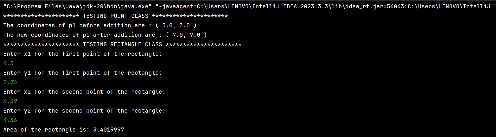
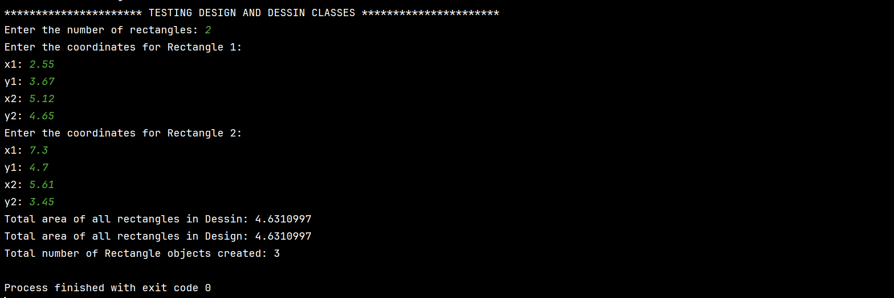
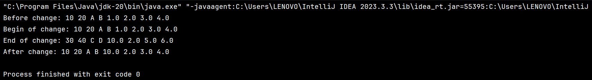

<h1 align="center">🔷 Rectangle Drawing Application 🔷</h1>

Welcome to the Rectangle Drawing Application! This project enables users to create intricate drawings composed of multiple rectangles effortlessly. Whether you're an artist 🎨, designer ✏️, or simply love geometry 🔷, this application provides a versatile tool to express your creativity.

## Table of Contents

- [Description](#description) 📝
- [Features](#features) ✨
- [Exercises](#exercises) 🏋️‍♂️
- [Classes](#classes) 📚
- [Usage](#usage) 🚀
- [Tools and Languages](#tools-and-languages) 🔧
- [Execution](#execution) 💻

## Description 📝

The Rectangle Drawing Application simplifies the creation and manipulation of rectangles within a graphical space. It includes meticulously crafted classes to handle various aspects of rectangle management, ensuring seamless creation, modification, and visualization.


## Features ✨

- **Create Drawings**: Generate drawings with multiple rectangles to visualize complex layouts.
- **Add Rectangles**: Dynamically add rectangles to your drawing with customizable dimensions.
- **Calculate Area**: Obtain the total area covered by all rectangles in the drawing with a single click.
- **Calculate the number of objects created**: Get insights into the number of objects created in the application.


## Exercises 🏋️‍♂️

 ---
### Exercise 2

#### Description 📝

Implementing encapsulation, write Java code for the Point class. A point is defined by its x and y coordinates (float). The class doesn't define any constructor.

#### TestPoint Class

- Create and initialize an object `point` of type `Point` to coordinates (5,3).
- Add 2 to the x-coordinate and 4 to the y-coordinate of `point`.
- Display the new coordinates of `point`.
 ---
### Exercise 3

#### Description 📝

1. Rewrite the Point class from Exercise 2, adding a constructor with two parameters to initialize the point's coordinates.
2. Using the Point class, define a Rectangle class describing a rectangle by its bottom-left and top-right points. It has two constructors: one with the coordinates of the defining points and the other with two points to initialize the rectangle's attributes.
3. Write methods to calculate the length, width, and area of the rectangle.
4. Implement a method to count the total number of Rectangle objects created.

---
### Exercise 4

#### Description 📝

Consider the Dessin class; a drawing consists of multiple rectangles. The Dessin class contains an array of rectangles, and its size is set by the constructor. A method `add(Rectangle r)` adds a rectangle `r` to the drawing, and `sum()` calculates the total area of the rectangles.

### Exercise 5

#### Description 📝

Enter the following java code and explain the result obtained by executing it.

```java
public class Test {
    public static void main(String[] args) {
        int x = 10;
        int y = 20;
        String s1 = "A";
        String s2 = "B";
        Rectangle p1 = new Rectangle(1, 2);
        Rectangle p2 = new Rectangle(3, 4);
        System.out.println("Before change: " + x + " " + y + " " + s1 + " " + s2 + " " + p1.getLength() + " " + p1.getWidth() + " " + p2.getLength() + " " + p2.getWidth());
        change(x, y, s1, s2, p1, p2);
        System.out.println("After change: " + x + " " + y + " " + s1 + " " + s2 + " " + p1.getLength() + " " + p1.getWidth() + " " + p2.getLength() + " " + p2.getWidth());
    }
    
    public static void change(int a, int b, String n, String m, Rectangle p, Rectangle q) {
        System.out.println("Begin of change: " + a + " " + b + " " + n + " " + m + " " + p.getLength() + " " + p.getWidth() + " " + q.getLength() + " " + q.getWidth());
        a = 30;
        b = 40;
        n = "C";
        m = "D";
        p.setLength(10);
        q = new Rectangle(5, 6);
        System.out.println("End of change: " + a + " " + b + " " + n + " " + m + " " + p.getLength() + " " + p.getWidth() + " " + q.getLength() + " " + q.getWidth());
    }
}
```
## Classes 📚

### Point.java 🔹

The `Point` class represents a point in a 2D Cartesian coordinate system. It encapsulates the x and y coordinates of the point and provides methods to set and get the coordinates, as well as to add increments to the coordinates.

### Rectangle.java 🟩

The `Rectangle` class represents a rectangle in a 2D Cartesian coordinate system. It provides methods to calculate the length, width, and area of the rectangle. Additionally, it tracks the number of instances created.

### Dessin.java 🖼️ && Design.java 🎨

The `Dessin` and `Design` classes represent a drawing composed of multiple rectangles. The `Design` class uses uses an **`ArrayList`** to store the rectangles while the `Dessin` class uses an **`array`** to store the rectangles and both provide methods to add rectangles to the drawing and calculate the total area.

### TestPoint.java 🧪

The `TestPoint` class is the main program used to test the functionality of the `Dessin` and `Design` classes.

### Test.java 🧪
The `Test` class  demonstrates the behavior of Java method parameter passing by value and reference. Observe how the variables x, y, s1, s2, p1, and p2 change or remain unchanged after the change method is called.


## Usage 🚀

1. **Clone the Repository**: Clone this repository to your local machine using `git clone`.
2. **Navigate to the Project Directory**: Open a terminal and move into the project directory.
3. **Navigate to the Source Directory**: Change directory to the `src` folder.
4. **Compile and Run**: Compile and run the `TestPoint.java` file.
   - Compile: `javac *.java`
   - Run: `java TestPoint`
5. **Interact with the Application**: Follow the on-screen instructions to create drawings, add rectangles, and calculate the total area.

## Tools and Languages 🔧

- **Java**: Primary programming language.
- **IntelliJ IDEA**: Integrated Development Environment (IDE).

## Execution 💻

### For the `TestPoint.java` file:



---

### For the `Test.java` file:


